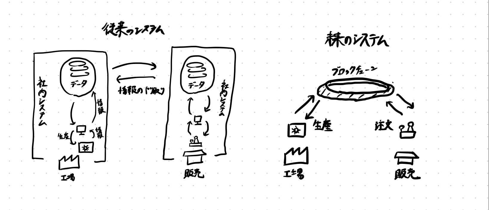

# ブロックチェーンの活用事例
**Basic**

学際ゼミ２期 / CryptoAge / Cloud League
慶應義塾大学理工学部3年
TAKAHIRA (@ocean_t_shirt)

# Web3がやってきた！
### **ブロックチェーンが実現する、分散型のシステム**
次世代のインターネット（Web3）は、個人と個人を直接繋げるネットワークを実現します。

これまでのインターネットにおけるサービスのユーザーは、特定の会社が管理するプラットフォーム（TwitterやYouTubeなど）の上で、商売の道具だった。

これからのインターネットは、各個人がサービスに直接投資し、提言し、より良い環境を実現します。

# リーディングについて
### **『ビットコイン：P2P 電子通貨システム』**
ブロックチェーンの概念を生み出した文書。
ざっくり言うとこんな感じ。
- ビットコインは、個人間で直接的な電子決済を行う仕組みである。
- 複数のコンピュータで暗号計算を行うことで、取引の正当性を保証している。
- 記録を改ざんするのは、コンピュータの処理能力が足りないことから、不可能である。

# ブロックチェーンとは何か
### **分散型台帳 - 改ざん不可能な記録**
> ブロックチェーンは、ビットコイン・ネットワーク全体の拠り所となる、共有された公開台帳です。承認済みのトランザクション全てが、このブロックチェーンに記録されています。これにより、ビットコイン・ウォレットは支出可能な残高を算出し、新しいトランザクションにコイン使用者が所有するビットコインが使用されたと確認できるのです。

（引用元）bitcoin.org

# ブロックチェーンを支える仕組み
### **トランザクションとマイニング**
ブロックチェーン上で行われた取引が「トランザクション」
トランザクションの内容をコンピュータ処理によって整合性を確認し、承認するのが「マイニング」

ブロックチェーン上でトランザクション（ブロックチェーン上の処理）を行う際に、「GAS代」と呼ばれるマイニング報酬を払わなければならない。その金額は、ブロックチェーンごとに異なっている。

<!-- 要改善 -->
# ブロックチェーンがもたらすもの
- コスト削減
  - 人や会社が生み出していた信頼から、ブロックチェーン上にある改ざん不可能なコード（スマートコントラクト）と、改ざん不可能な記録（トランザクション）による信頼へ：「トラストレス」
  - > DON'T TRUST. VERIFY.
- 分散化（CentralizedからDecentralizedへ）
  - 誰かが管理するのではなく、みんなで管理する。民主的。
- トレーサビリティ

# （ブロックチェーンの種類）
ブロックチェーンは、その管理者・公開範囲によって、大きく３種類に大別される。
- パブリックチェーン：不特定多数が運営、公開
- コンソーシアムチェーン：特定組織が管理、公開
- プライベートチェーン：特定組織が管理、非公開

今回は主にパブリックチェーンについて解説する。

# ブロックチェーンの抱える課題
- ブロックチェーン技術の課題
  - セキュリティ
    - 51%攻撃
  - 環境問題
- ブロックチェーンを取り巻く環境の課題
  - 法整備（税制など）
  - 詐欺の横行

（今回は説明を省略する。後に議論を行う。）

# ブロックチェーンのユースケース
ブロックチェーンの活用事例が多い分野は以下の通り
- 金融・保険
- 通信・メディア・エンターテイメント
- ヘルスケア

# （トークンとコイン）
トークンとコインという2つの概念について説明する。
- コイン：各ブロックチェーン特有の通貨。通貨のように価値を持ち、マイニングを行った人に報酬として提供される。例はBTCやETH、ASTRなど。
- トークン：各ブロックチェーン上に作成された記録。複数個存在する「FT」と、唯一不二な「NFT」の２種類が存在する。例はJPYCやVeryLongAnimalsなど。いくつか規格がある。

有力なコインがいくつかあって、それをベースにいろんなトークンを作成できるみたいなイメージ。

<!-- 金融 -->
# 金融
金融分野における使用事例は、分野によって大きく以下のように分けられる。
- 仮想通貨
- 仮想通貨に関連した銀行・金融取引業

などが挙げられる。
（その他、既存の銀行における記録の管理などの用途もあるが、トレーサビリティの項で関連した用途に触れるのでここでは省略する）

# 仮想通貨
ブロックチェーン上に取引が記録された通貨。

# 仮想通貨の課題
- ボラティリティが大きい
  - 裏付け資産がない
- ハッキング・資金ロンダリング
  - どのアカウントが資金を使用したのかはわかるが、そのアカウントが誰なのかわからない

# ステーブルコイン
価値が現実の通貨に連動しているトークン。
代表例として、
- USDT (テザー)：ドル連動
- JPYC：日本円連動

などが挙げられる。
日本において、ステーブルコインは暗号資産ではなく前払式支払手段：プリペイドカードと同じ扱いである。
（ステーブルコインの仕組みについての説明は省略する）

# 分散型金融（DeFi）の夜明け
## **プログラムされた銀行の登場**
既存の銀行が行なっていたような取引を、スマートコントラクト（ブロックチェーン上にあるコード）が実行する。
- レンディング
- DEX 分散型取引所
- DAO 分散型組織

などの種類がある。

# レンディング
個人間で仮想通貨の貸し借りを行うことができる。年利が発生する。

## 事例
（ETH）Compound
（Astar）Starlay Finance

# DEX 分散型取引所
仮想通貨同士で交換する。外貨両替のようなもの。
BitflyerやCoincheckのような中央集権型の取引所（CEX）と比べ、リスクが高いが、手数料が低く、分散的

（ETH）Uniswap
（Astar）ArthSwap

# DAO 自律分散型組織
ここでは特に、投資組織としてのDAOに注目する。
個人が資金を提供し、投票や特定のアルゴリズムで投資先を決定する。

# 分散型金融（DeFi）の夜明け
## 論点
- 分散型金融の登場により、個人間の金融取引が増えた場合、どのようなリスクが存在すると考えられるか。

<!-- # 保険 -->

<!-- # コンテンツ
コンテンツ分野において、以下のような事例が存在する
- 創作物
- ゲーム -->

# コンテンツ
ブロックチェーンを用いると、以下のようなことが可能になる。
- デジタルアートに個数の概念を与える
- 権限管理
  - デジタルコンテンツに所有権をもたらす
  - 2次創作者の権利を管理し、収益を分配する仕組みを分散的に実現できる。
<!-- -  -->

# エンターテイメント
## **NFTアートの価値**
- ブランド
  - "CryptoPunks"や、"AZUKI"のような有名なNFTコレクションは、持っているだけで注目される。
- ホールダー同士の交流
  - "VeryLongAnimals"コレクションは、初期ホールダーに国内有力ベンチャーの社員が居たうえ、毎日ホールダー同士の交流イベントが行われた。NFTホールダーコミュニティに参加し、新たな人間関係を築く目的で購入した方々も多いと思われる。

# エンターテイメント
## **NFTアートの価値**
- アートとしての価値
デジタルアートを買って所有する（そして見せびらかす）ことが可能になった。
BAYCやCryptoPunksのようなジェネレーティブNFTは、特定のパーツからランダム生成されており、特定のパーツに希少性を見出してコレクションする人々もいる。

# エンターテイメント
## **NFTアートの価値**
- 投資対象としての側面
NFTブームにより、NFTの価値は上昇傾向にある。安く買って高く売ろうと、投資家が特定のコレクションに高値を付けている。
BAYCのように、購入したイラストを商用利用することを認めているコレクションもある。

# エンターテイメント
## **NFTアートの未来**
最近、TwitterのアイコンにNFTを使用できるようになった。
今後、SNSのアイコンや、メタバース内でのNFTの表示機会が増えると、自己顕示欲を満たす側面が大きくなるのではないかと私は考えている。

また、「ホールダーではないのにNFTをプロフィール画像にするのはダサい」という文化が生まれつつある(気がする)ので、NFTの売買がより一般的になるのではないかと考えている。

# NFTアートの未来
なお、NFTの取引量はここ1年で70倍になっている。

# トレーサビリティ
トレーサビリティの分野では、ブロックチェーンは大きく2つの目的で活用されている。
- ブランディング
- 管理の合理化

# トレーサビリティ
## **信頼できる商品**
生産地・加工地等の証明をすることで、商品に信頼を与え、付加価値をもたらしている。

# トレーサビリティ
## **サプライ・チェーン・マネジメント**
ブロックチェーンを用いたサプライチェーン管理システムは、データの受け渡しのみならず、処理を自動化する。

# その他、以下のような分野で活用されている
 - 研究
   - 論文管理
 - 医療
   - 臨床開発

<!-- # 日本国内での法的課題
-  -->

# 日本におけるブロックチェーンに関連した事件

- 2003年 Winny事件（P2Pソフトウェアを巡る裁判）
  - Winnyという、個人間でファイル共有できるソフトウェアが流行。しかし、違法コピーのコンテンツの共有や、ウイルスの蔓延で問題になった。このとき、一部の使用者と、開発したエンジニア・金子勇が逮捕される。
  - 後に金子勇は無罪になったが、ブロックチェーン技術の先駆けとも言えるWinnyの開発は、裁判中の八年間開発が止まってしまった。

# 日本におけるブロックチェーンに関連した事件
- 2014年 Mt.GOX事件
  - 当時、東京に本社があり、世界最大級の仮想通貨取引所だったMt.GOX社がハッキングに遭い、470億円相当のビットコインが消失した事件。各国が規制を強化するきっかけになった。同時に、暗号資産が金融商品の一つとして認められるきっかけになった。

# 日本におけるブロックチェーンに関連した事件
- 2018年 Coincheck事件
  - 仮想通貨取引所CoinCheckがハッキングに遭い、580億円相当の仮想通貨NEMを流出した事件。
  - ホットウォレットによる管理が原因（後日詳細を調査します）
  - ダークウェブを用いてロンダリングされ、追跡が困難に

# 論点
- 分散型の組織は存在しうるのか
- 分散型のシステムにおいて、責任は誰が取るのか
- Web3人材の海外流出を防ぐには

# 参考書籍
- ブロックチェーン3.0 国内外特許からユースケースまで
- ブロックチェーン技術概論 理論と実践
- ブロックチェーン実践入門
- ブロックチェーンプログラミングのためのコンピュータサイエンスがわかる本
- SolidityとEthereumによる実践スマートコントラクト開発