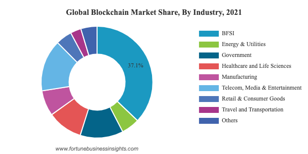
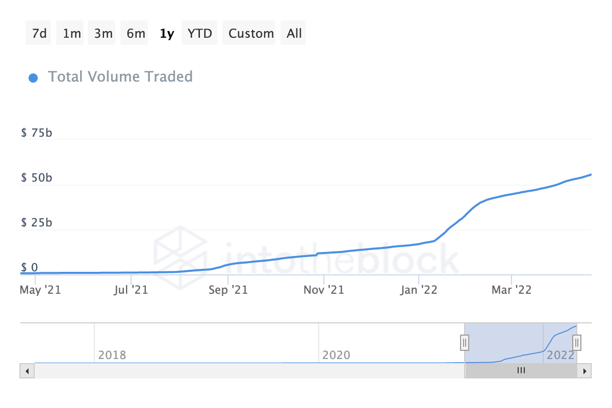

# ブロックチェーンの活用事例
**Basic**

学際ゼミ２期 / CryptoAge / Cloud League
慶應義塾大学理工学部3年
TAKAHIRA (@ocean_t_shirt)

# リーディングについて
## **『ビットコイン：P2P 電子通貨システム』**
ブロックチェーンの概念を生み出した文書。
個人間で安全に取引を行うシステムを提案している。

要点は3点。
- 個人間で取引を行う
- 

# ブロックチェーンとは何か
### **分散型台帳 - 改ざん不可能な記録**
> ブロックチェーンは、ビットコイン・ネットワーク全体の拠り所となる、共有された公開台帳です。承認済みのトランザクション全てが、このブロックチェーンに記録されています。これにより、ビットコイン・ウォレットは支出可能な残高を算出し、新しいトランザクションにコイン使用者が所有するビットコインが使用されたと確認できるのです。

（引用元）bitcoin.org

# ブロックチェーンを支える仕組み
### **トランザクションとマイニング**
ブロックチェーン上で行われた取引が「トランザクション」
トランザクションの内容をコンピュータ処理によって整合性を確認し、承認するのが「マイニング」

ブロックチェーン上でトランザクション（ブロックチェーン上の処理）を行う際に、「GAS代」と呼ばれるマイニング報酬を払わなければならない。その金額は、ブロックチェーンごとに異なっている。

# ブロックチェーンとは何か
### **分散型台帳**
代表的な活用例は、
- 仮想通貨
- NFT

などが有名

（後ほど補足します）

# ブロックチェーンの種類
ブロックチェーンは、その管理者・公開範囲によって、大きく３種類に大別される。
- パブリックチェーン
- コンソーシアムチェーン（今回は説明を省略する）
- プライベートチェーン（今回は説明を省略する）

# ブロックチェーンがもたらすもの
- コスト削減
- 分散化（CentralizedからDecentralizedへ）
- トレーサビリティ

# ブロックチェーンの抱える課題
- ブロックチェーン技術の課題
  - セキュリティ
    - 51%攻撃
  - 環境問題
- ブロックチェーンを取り巻く環境の課題
  - 法整備（税制など）
  - 詐欺の横行

（今回は説明を省略する。後に議論を行う。）

# 本題に入ります

# ブロックチェーンのユースケース
ブロックチェーンの活用事例がある分野は以下の通り

- 金融・保険
- 通信・メディア・エンターテイメント
- ヘルスケア

# トークンとコイン
ブロックチェーンの詳細について触れる前に、トークンとコインという2つの概念について説明する。
- コイン：各ブロックチェーン特有の通貨。通貨のように価値を持ち、マイニングを行った人に報酬として提供される。例はBTCやETH、ASTRなど。
- トークン：各ブロックチェーン上に作成された記録。複数個存在する「FT」と、唯一不二な「NFT」の２種類が存在する。

<!-- 金融 -->
# 金融
金融分野における使用事例は、分野によって大きく以下のように分けられる。
- 仮想通貨
- 仮想通貨に関連した銀行業

などが挙げられる。
（その他、銀行における記録などの用途もあるが、ここでは省略する）

# 仮想通貨
ブロックチェーン上に取引が記録された通貨。

# 仮想通貨の課題
- ボラティリティ

# ステーブルコイン
価値が現実の通貨に連動しているトークン。
代表例として、
- USDT (テザー)

国内事例では
- JPYC

などが挙げられる。

# ステーブルコインの仕組み

JPYCのホワイトペーパー

# 分散型金融（DeFi）の夜明け

仮想通貨における銀行の役割を果たしているコード。
- レンディング
- DEX 分散型取引所
- 
- DAO 分散型組織
などの種類がある。

既存の銀行が行なっていたような取引を、スマートコントラクト（ブロックチェーン上にあるコード）が実行する。

# レンディング
資金の貸し借りを行う。

## 事例
（ETH）Compound
（Astar）Starlay Finance

# DEX 分散型取引所

これまで、中央集権型の取引所（CEX）における

（ETH）
（Astar）

# DAO 分散型組織

ここでは特に、投資組織としてのDAOに注目する。

# 分散型金融（DeFi）の夜明け
## 論点
- 分散型金融の登場により、個人間の金融取引が増えた場合、どのようなリスクが存在すると考えられるか。

# 

# 保険

# コンテンツ
コンテンツ分野において、以下のような事例が存在する
- 創作物
- ゲーム

# コンテンツ
ブロックチェーンを用いると、以下のようなことが可能になる。
- デジタルアートに個数の概念を与える
- 権限管理
  - デジタルコンテンツに所有権をもたらす
  - 2次創作者の権利を管理し、収益を分配する仕組みを分散的に実現できる。
- 

# エンターテイメント
## **NFTアートの価値**
- ブランド
  - 最初のNFTコレクション"CryptoPunks"や、
- ホールダー同士の交流
  - "VeryLongAnimals"コレクションは、初期ホールダーに国内有力ベンチャーの社員が居たこと、毎日ホールダー同士の交流イベントが行われたことから、NFTホールダーコミュニティに参加し、新たな人間関係を築く目的で購入した方々も多いと思われる。

# エンターテイメント
## **NFTアートの価値**
- アートとしての価値
所有を認められるようになったことで、絵画と同様の

# エンターテイメント
## **NFTアートの未来**
最近、TwitterのアイコンにNFTを使用できるようになった。
今後、SNSのアイコンや、メタバース内でのNFTの表示機会が増えると、自己顕示欲を満たす側面が大きくなるのではないかと私は考えている。

また、「ホールダーではないのにNFTをプロフィール画像にするのはダサい」という文化が生まれつつあると感じており、

# NFTアートの未来
なお、NFTの取引量はここ1年で70倍になっている。

# トレーサビリティ
トレーサビリティの分野では、ブロックチェーンは大きく2つの目的で活用されている。
- ブランディング
- 管理の合理化

# トレーサビリティ
## **信頼できる商品**
生産地・加工地等の証明をすることで、商品に信頼を与え、付加価値をもたらしている。

# トレーサビリティ
## **サプライ・チェーン・マネジメント**
ブロックチェーンを用いたサプライチェーン管理システムは、データの受け渡しのみならず、処理を自動化する。

# その他、以下のような分野で活用されている
 - 研究
   - 論文管理
 - 医療
   - 臨床開発

# 日本国内での法的課題
- 

# P2Pソフトウェアをめぐる事例
## 悲劇のエンジニア・金子勇

# 論点
- トークンエコノミーの可能性

# 参考書籍
- ブロックチェーン3.0 国内外特許からユースケースまで